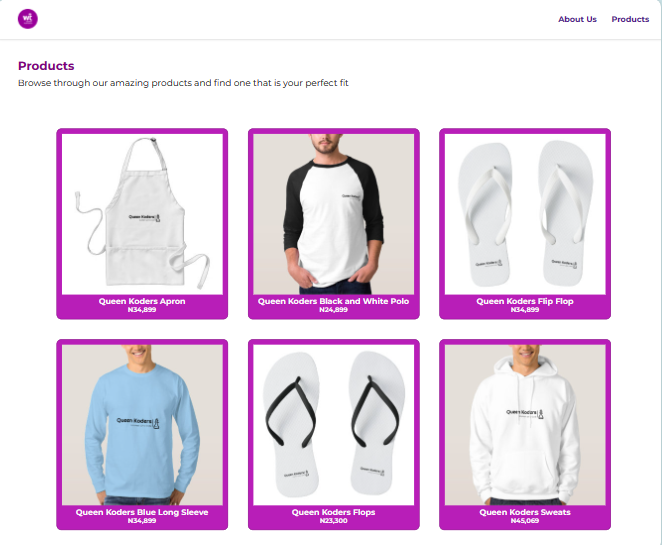

# Queen Koders Ecommerce Project

## Task

- This is a simple project done as a team which involves creating a simple e-commerce site with two pages. One page is an about us page and the other contains the products.

 ## Guideline to view the project

 To view the project on your local machine.
 - Clone the repository 

 ``git clone https://github.com/Perpy-del/queen-koders-ecommerce.git``

 - Change your current working directory to the project directory

 ``cd queen-koders-ecommerce``

 - Open the index.html file and run it on your local machine

 ## Contributors include

 - [Stella Ugoo-Okonkwo](https://github.com/Ozyugoo)
 - [Wokrit Bakkuk](https://github.com/wokrit)
 - [Perpetual Meninwa](https://github.com/Perpy-del)
 - [Chioma Ekpemerechi](https://github.com/Codiadem)

 ## Screenshot of the project

